# Laporan-Praktium-9

## NAMA   : IMAM SOLEHUDIN
## NIM	  : 312110290
## KELAS  : TI.21.C.1
## MATKUL : PEMROGRAMAN ORIENTASI OBJEK

1. Chapter 14 Show Message Dialog

- Program 

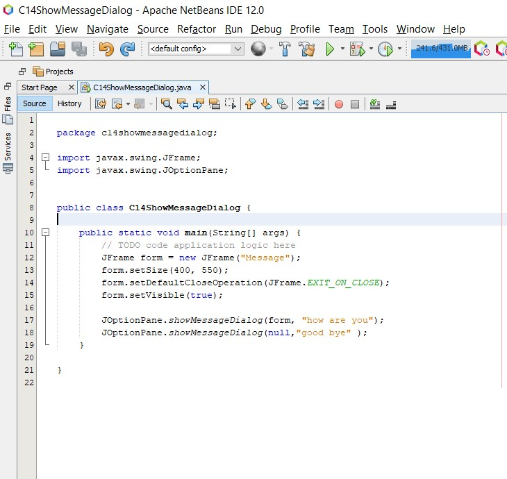

- Hasil

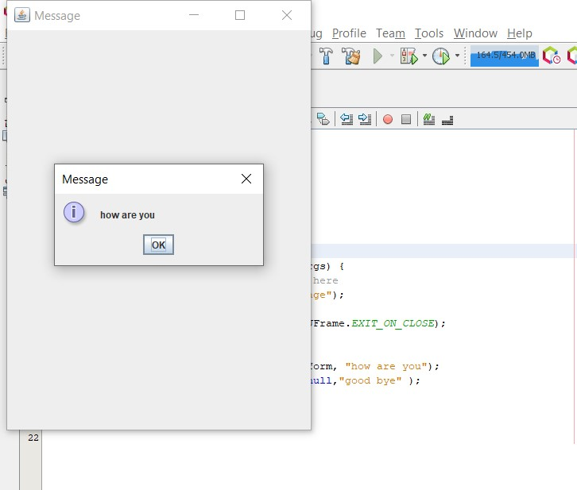

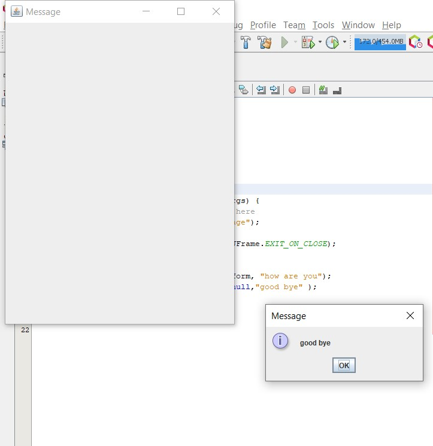

- Program

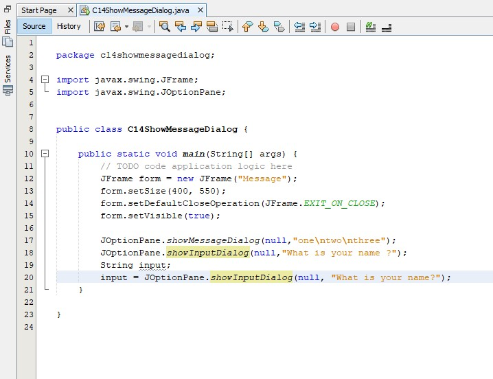

- Hasil

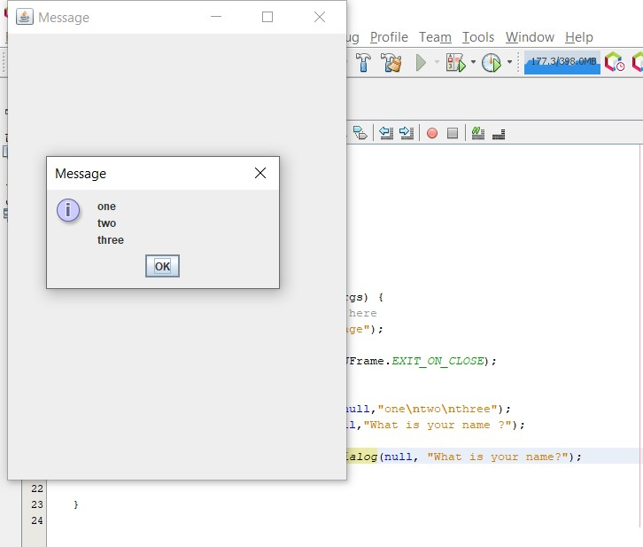

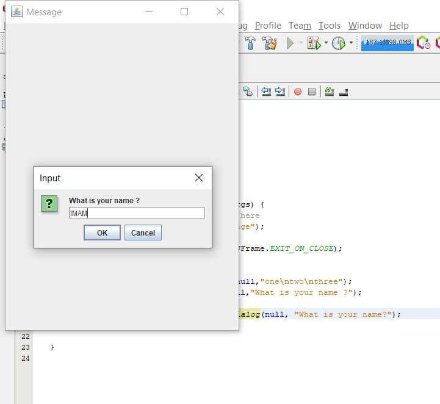

2. Chapter 14 Default JFrame

- Program

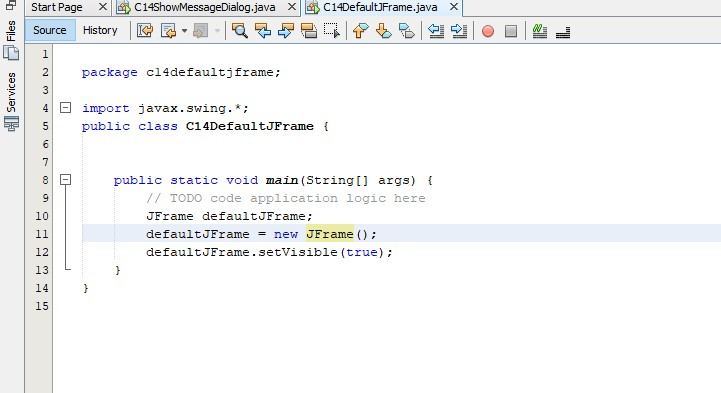

- Hasil

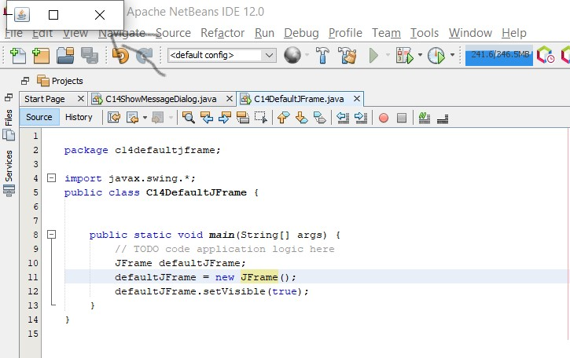

3. Chapter 14 JFrame Subclass1

- Program

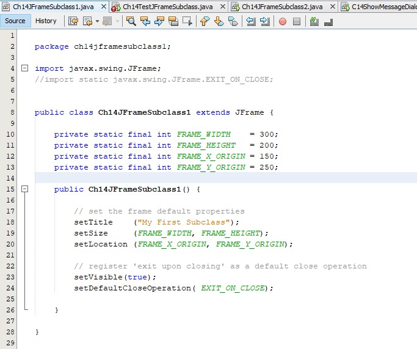

- Hasil

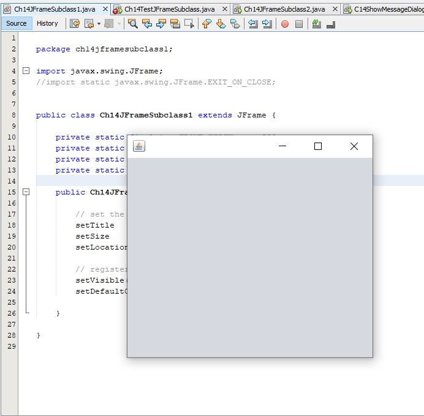

4. Chapter 14 JFrame Subclass2

- Program

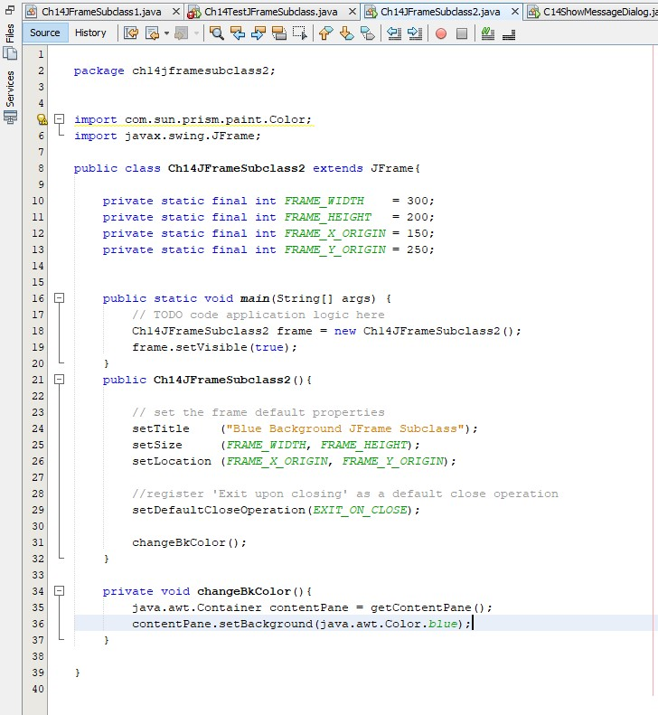

- Hasil

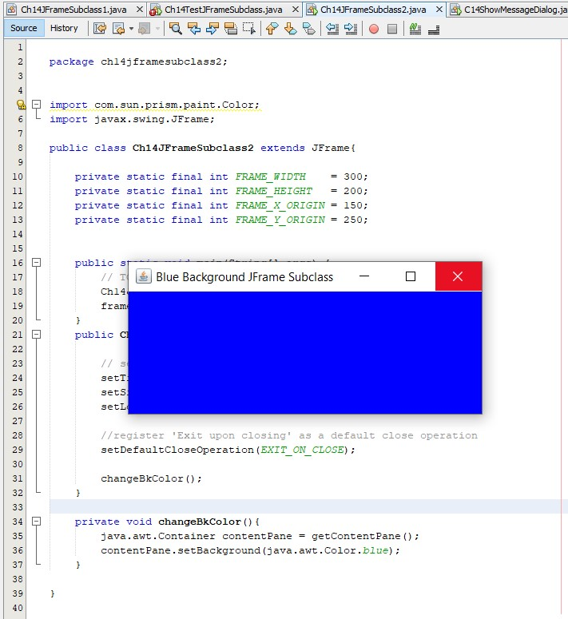

5. Chapter 14 JButton Frame

- Program

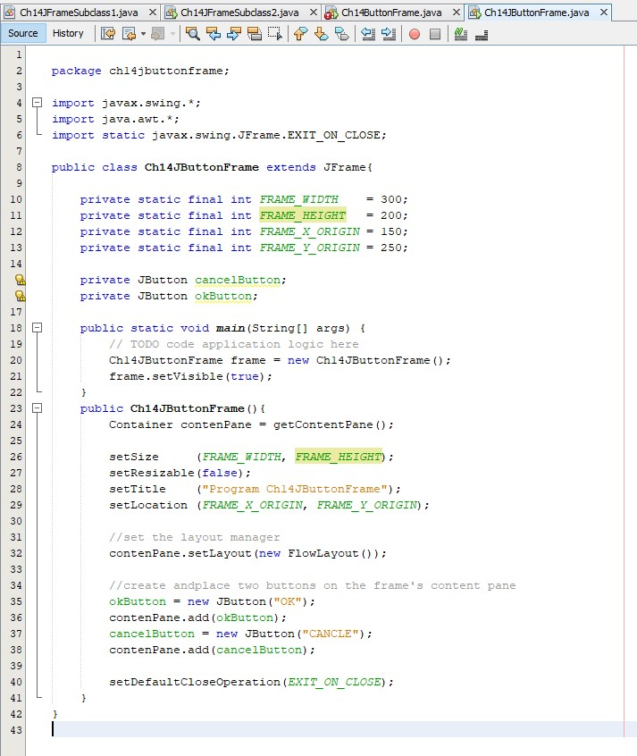

- Hasil

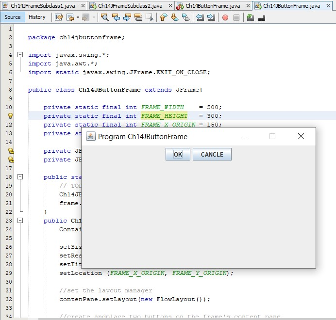